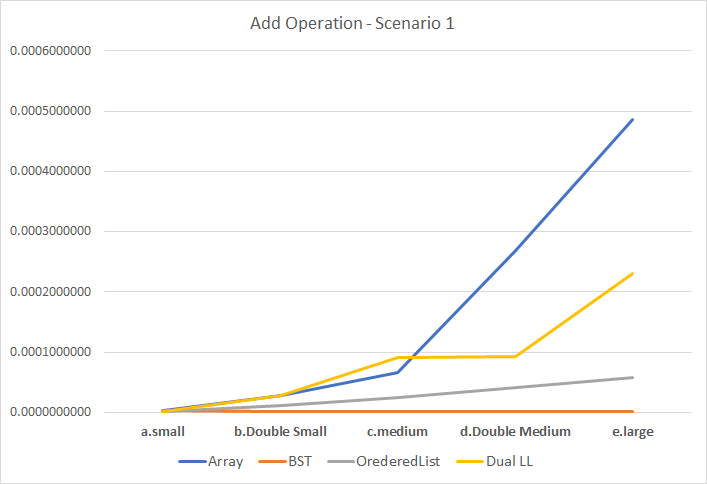
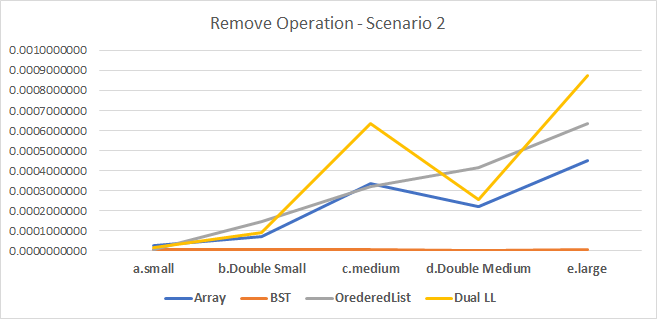
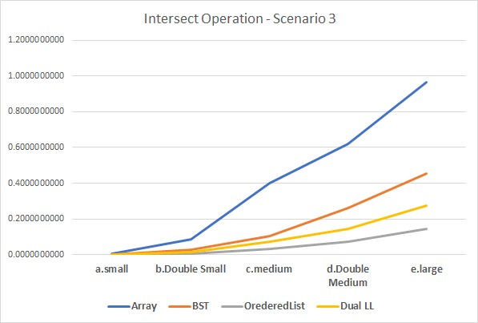
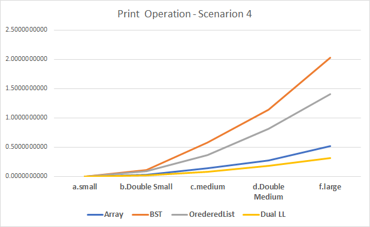

# MultiSet-Using-ADT
Algorithm and Analysis - Implementation of Multiset using ADTs such Array, LinkedList, BST, Dual Ordered Linked List etc

# Abstract
An analysis of implementation of Multiset(bag) abstract data structure using Arrays, Binary Search Tree (BST), Ordered Linked List and Dual Ordered Linked List in Java is carried out and evaluated their performance in terms of four common operations such as growing the multiset, shrinking the multiset, intersecting two multisets and printing the multisets. The algorithm for these four scenarios of all 4 implementations are evaluated by running the regression tests against them using different datasets of various sizes and exact timings are recorded for each test scenarios and finally average them individually for each operation of different implementations. From the obtained results of our devised algorithms, we state that the Multiset using Binary search tree is efficient in case of adding, removing and intersecting operations. When it comes to print operation, the performance is not at its best on comparing with other implementations, but it performs reasonably well in overall.

# Data Generator Algorithm:

```
1.Generate datasets(small, double small, medium, double medium, large)
2.perform testing for(array, bst, orderedll, dualll)
	3.for(add, remove, intersect, print)
		4.for( small, double small, medium, double medium, large)
			5.for(best, worst, average)
				6.Record the time
7.Repeat process from 1 – 6 to get results of 50 runs.
```
# Results:

* Add Operation Emperical Analysis




* Remove Operation Emperical Analysis




* Intersect Operation Emperical Analysis




* Print Operation Emperical Analysis




# Conclusion:

From the experimental results, we hereby conclude that Binary Search Tree(BST) Data structure can be used for the efficient 
implementation of the Multiset(bag) because in terms of running time ,the BST outperforms every other 3 implementation for the operations such as growing multiset, shrinking multiset and intersecting two multisets. BST’s performance takes a dig only in printing operation which provides a room for future enhancements, as our algorithm is designed a way such that part of its operation is dependent upon array multiset, but still the performance is not the worst.
	
### Recommendations based on analysis
- For applications with large datasets, where frequent insertions, deletions and searching is required, BST would be 
perfect fit. The searching complexity at max would be O(n) which is good when compared to others.
- In applications where data does not change much after initial initialisation or is not exposed to many updates, but 
requires constant access to highest occurring data, Dual ordered list would be a better fit. The complexity will 
always be O(n)
- Dual linked list can also be recommended where all data elements are unique and are inserted in ascending order.
This way both print and insert would be performed in O(n)
- Applications involving the large sets and where insertions and deletions are frequent, and often required to 
compare the two lists or get common elements, Ordered List can give best results.
- Where memory is not a constraint, instead of using min-dynamic array, we can use double-dynamic array which 
would significantly reduce the number of shifting operations required for insertion as well as removal due to 
availability of space.
	
# Future enhancements based on analysis:

1. Try to achieve the height balanced BST. The BST will behave like list when a sorted order of element is provided while 
creating BST.
2. While removing an element from the Array, we can replace that element with the last element. This will save the shifting 
operations required for new insertions as well.
3. A tail pointer can be maintained which can then be effectively used for each operation potential providing constant time 
complexity for some of the worst cases.
	a. For add operation, if the new element is larger than tail element then inserts at the end.
	b. For remove operation, if the element is equal to tail element, then remove the last element
	c. For intersect operation, if the tail element of first list is smaller than second list, we can softly say that there will be no 
common elements and hence an empty Multiset can be returned.
4. Instead of going for selection sort algorithm in Array Multiset, more sophisticated sort algorithms can be used to further  improve the performance of Array Multiset, which in turn improves the efficiency of BST and Ordered Linked List as well, as  their print functions are dependent on array sorting.

# Contributors:

-Yogeshwar Chaudhari, RMIT 2020, School of Science
-Sriram Senthilnathan, RMIT 2020, School of Science
-Jeffrey Chan & Yongli Ren, RMIT 2020
